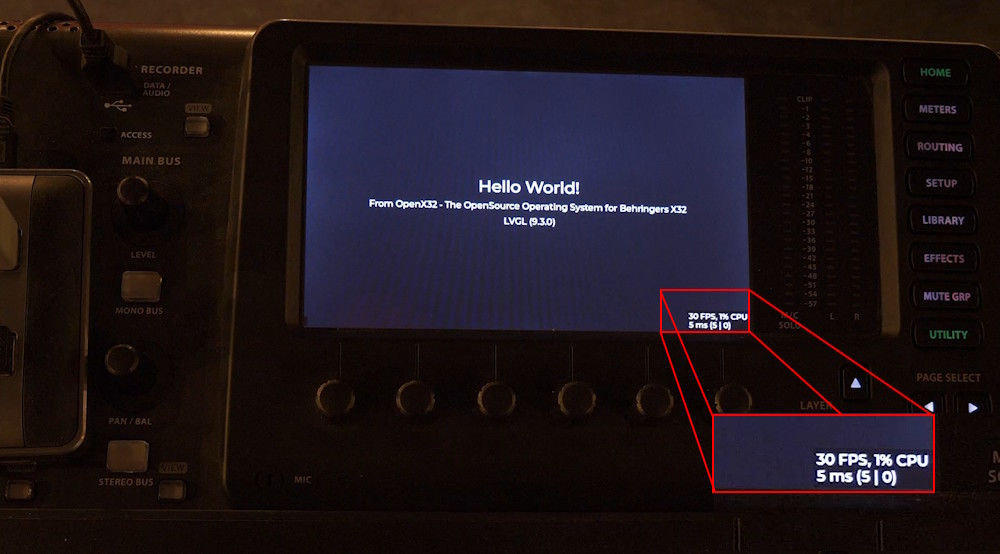

# OpenX32 - A linux-based operating system for the Behringer X32

This repository contains software to load and start the Linux-Kernel on the Behringer X32. This audio-mixing-console uses a Freescale/NXP i.MX253 Microcontroller with an ARM926EJ-S core that supports booting Linux.


Currently the Linux Kernel is running in Version 6.12 (LTS) with busybox:


More information in my related Youtube-Video:

[](https://www.youtube.com/watch?v=6CfLC5xVy90)

## General idea
The Behringer X32 has an USB-Type-B-Connector and two hidden switches at its back. The USB-connector is connected to an NXP i.MX253 microcontroller while the two switches are connected to its reset and boot-mode-switch. This allows us to boot the system in a firmware-update-mode.

Using the pyATK-software we can upload individual files directly to the RAM of the controller. Here a 64MB LPDDR is connected to the controller, so that we can upload a full linux-environment together with a bootloader and a DeviceTreeBlob for the individual hardware of the X32.

As the linux is started from RAM directly, this project is a temporary replacement of the mixer. After a power-cycle, the original firmware is in place again. But its possible to replace the original SD-card with a new one containing the OpenX32, to boot the linux automatically after a power-cycle.

## Steps to compile and load the new operating system

### Step 1: Init Git-Submodules and install dependencies
This system uses the most recent versions of the tools I could find: the bootloader u-Boot is used in Version 2020.10 as this is the last U-Boot supporting the i.MX25. Up to now Linux has still support for the i.MX25 and I selected v6.12, the most recent LTS-kernel.

So the repository uses other GitHub-repositories as submodules (u-Boot, Linux and pyATK). Please use the following command to checkout the main-repo together with submodules. To minimze the download-size and -time, we will clone the submodules separately:

```
git clone --depth 1 https://github.com/xn--nding-jua/OpenX32.git
cd openx32
./gitinitsubmodules.sh
```

Next to the sourcecode, your system needs to be setup correctly to compile the whole system: setup your debian-based system by calling:
```
./setup.sh
```

This script will install several dependencies to compile u-boot and the linux-kernel. After installing the packets, it will patch pyATK to run with recent versions of Python 3.11 and newer. It will also configure pyATK in a virtual python-environment.


### Step 2: Run the scripts

Compile u-boot, Linux and busbox by calling the script ./compile_all.sh and upload the new operating system into the RAM by calling the script ./run.sh

```
./compile_all.sh
./run.sh
```

* compile_all.sh will copy some patched files into the submodules, compile a small program called "miniloader", the U-Boot-bootloader and the Linux kernel. The kernel-image "zImage" will be converted to a "uImage" and will be merged together with the miniloader and u-boot-image into a single binary-file.
* Finally, run.sh will use pyATK to initialize the most important hardware of the i.MX253 using the file "meminit.txt" and upload the generated binary-blob into the RAM of the processor. The Serial-Download-Program of the i.MX will then start the small assembler-program "miniloader" placed at address 0x80000000 - hence the begin of the RAM. The only task of Miniloader is to jumpstart the U-Boot-Bootloader at offset 0x3C0. U-Boot is placed at offset 0x0C0, but the first function-entry of the U-Boot will not start when using the Serial-Download-Program. So with this small hack, U-Boot takes control over the i.MX, reallocate itself to a higher memory-region and starts the linux-kernel together with the DeviceTreeBlob. The kernel is then decompressed and will start up.

### Step 3: Compile user-softwares

Within the software-folder several user-applications are placed. You can call the script "compile_software.sh" to compile all softwares at once or compile them individual:
* x32ctrl: call "make". The binary is copied to the folder "../bin/"
* x32sdconfig: call "compile.sh". Program will read the original SD-card on boot and put general information about the board to the folder /etc/

There are some test-softwares in the "test"-folder. Use individual "compile.sh" scripts
* fpgaconfig: program to configure the Xilinx Spartan 3A FPGA using spidev2.0
* dspconfig: program to configure the two AnalogDevices 21371 SHARC DSP using spidev0.0 and spidev0.1
* spiread: program to test the communication to the DSPs
* uarttest: program to test communication with FPGA

As the X32 has limited RAM available, you might use the script "build_distribution.sh" to copy all important files into the folder "usb". Then take an USB-Thumbdrive, copy all files within this folder to the root of the USB-drive and mount the device on the X32 with the command "mount /dev/sda1 /mnt/usb".

Now run the script "/mnt/usb/scripts/startall.sh". This will create important Symlinks to the main-system and start an SSH-Server.

Important: at this early development stage, some packages, libraries or other things *will* be missing. Please create a ticket in GitHub so that I can fix this.

### Step 4: Compiling logic for the FPGA

The X32 devices before 2020 are using a Xilinx Spartan-3A X3CS1400 FPGA to route the audio between the individual ADCs, DACs, expansion card and digital connectors like AES50 and UltraNet. For the Spartan-3A we can use the free version of Xilinx ISE 14.7 as the most recent toolchain to synthesize logic for this FPGA:

Download ISE 14.7 from the Xilinx (AMD) website: https://www.xilinx.com/support/download/index.html/content/xilinx/en/downloadNav/vivado-design-tools/archive-ise.html. There are two options: a preinstalled linux virtual machine or the direct version. The virtual machine is working fine. If you want to use the direct version under Windows, here is a short manual as this needs some adjustments:

1. Download the DVD image: https://www.xilinx.com/member/forms/download/xef.html?filename=Xilinx_ISE_DS_14.7_1015_1.tar
2. Start the setup and install the software (the setup will take a loooong time). Between 93% and 95% the installation will hang: go into the taskmanager and kill the software "Webtalk32.exe" and "xwebtalk.exe" several times until the setup finishes (successfully!)
3. Set the Windows-Environmental-Variable "XILINX_VC_CHECK_NOOP" to "1". Otherwise the software will complain about a non-installed VisualStudio Runtime 2008 even if it is installed correctly
4. On modern Windows 10/11 ISE 14.7 will not start beyond the Splash-Screen due to the use of "SmartHeap" within the file "libPortability.dll". Download a hotfix from https://github.com/xn--nding-jua/OpenX32/raw/refs/heads/main/files/xilinx_ise_hotfix.zip, extract to C:\Xilinx\ and run the batch-file. The script will replace the 32-bit/64-bit versions of libPortability.dll.
5. Start ISE 14.7, open the OpenX32 project and compile the logic of the main-schematic.
6. On the left side of ISE 14.7 create a configuration file (bitstream)
7. Copy main.bit to an USB-thumbdrive and load it either with "./fpgaconfig fpga.bit" or with the main-control-software "./x32ctrl fpga.bit"

An overview of the current FPGA-project can be found in the PDF-file of the top-schematic here: [View Schematic as PDF](https://github.com/xn--nding-jua/OpenX32/raw/refs/heads/main/Documentation/FPGA.pdf).

### Step 5: Compiling code for the SHARC DSPs

The X32 uses two AnalogDevices 21371 SHARC DSPs for mixing. These devices are supported by the CrossCore EmbeddedStudio v2.12:

1. Download CrossCore EmbeddedStudio v2.12.x: https://www.analog.com/en/resources/evaluation-hardware-and-software/software/adswt-cces.html#software-overview
2. Request 90-day Trial-Software from Analog Devices
3. Open the DSP-project in the folder "dsp"
4. Use "Project -> Compile all..." to compile current project and "dsp1.ldr" will be generated
5. copy "dsp1.ldr" to the USB-thumbdrive and load it either with "./dspconfig dsp1.ldr" or with the main-control-software "./x32ctrl fpga.bit dsp1.ldr"

DSP1 is the main-DSP receiving and sending all 40 audio-channels from and to the FPGA that is routing the audio to and from the individual sources. Within this first DSP the 32 + x main-channels are processed (noise-gate, multi-band-EQs, compressor, general mixing).

DSP2 is used for the more advanced audio-effects in the original system. This DSP is not used at the moment.

## What is working at the moment and what is planned so far
* [x] Linux-Kernel in Version 6.12 (LTS) starts to shell using display framebuffer
* [x] init-script for setting up the operating system
* [x] MIDI-Input and -output is used as an additional serial-port-terminal (see pinout down below)
* [x] Support of 800x480 32-bit framebuffer for applications (/dev/fb0)
* [x] Support of 100MBit ethernet network-support with DHCP
* [x] Support of internal Realtime-Clock
* [x] Support of USB-Host interface (HID-Keyboard, HID-Mouse, Mass-Storage-Devices, Joystick, Soundcard, etc.)
* [x] Support of internal SD-Card to read MAC-Address and the general configuration
* [x] Support of internal 8-channel analog input- and output-cards including headamp- and phantom-power-control
* [x] Support of internal 8-channel AUX-AD/DA-Converter (CS42438)
* [x] Support of both AnalogDevices DSPs (ADSP-21371 SHARC DSPs) via internal SPI-interface
* [x] Support of UltraNet-Output
* [x] Support of booting from SD-Card and via original DCP-Bootloader
* [x] Configuration of main-FPGA (Xilinx Spartan 3A, X3CS1400) via internal SPI-interface
* [x] Support of 1:1-routing for the available 112 inputs (32x XLR, 8x AUX, 32x Card, 40x DSP) to 112 outputs (16x XLR, 16x UltraNet, 8x AUX, 32x Card, 40x DSP)
* [x] Control of X32 surface (faders, buttons, LEDs, encoders) through x32ctrl-software
* [x] Noisegate, 4-band EQ and compressor per channel is already working within the main-DSP

So the most important things (audio in/out, control-surface, display) are working already. The high-level-audio-functions within the DSP need still more investigation...

More things are on the ToDo-list:
* [ ] In-Progress: implement logic for the Lattice FPGA and new AUX ADC/DAC in newer revisions of the X32
* [ ] In-Progress: Boot from barebox as a successor of U-Boot (U-Boot has ended the support of i.MX25 since a couple of years)
* [ ] Planned: Implement advanced audio-algorithm in DSP2
* [ ] Planned: ALSA Soundcard with I2S to main-FPGA (DeviceTree option "simple-audio-card" via SSI1 and AUDMUX is not initializing)
* [ ] Planned: GPIO support via libgpiod (at the moment libgpiod is not working and has no control over /dev/gpiochipX)
* [ ] Planned: Support of AES50 (needs more investigation on AES50-protocol)

LVGL v9.3.0 is running on the X32 with a good performance (30 fps). So this will be a basis for this open-source Operating System:


## Connecting a serial terminal to MIDI In/Out
The MIDI-Ports are connected to the UART5 of the i.MX25. With a simple resistor and a RS232/USB-converter the MIDI-ports can be used for a serial-terminal with 115200 baud:

    MIDI Out+ o---->---|       MIDI GND o------|          +5V o----->----o MIDI In+
      Pin 4          -----       Pin 2         o                           Pin 4
                     |   |                Pin 5 (GND)
                     |4k7|
      Pin 5          |___|                                                 Pin 5
    MIDI OUT- o----<---|----->----o Pin 2 (RxD)   Pin 3 (TxD) o-----<----o MIDI In-

## What's the reason for developing such a thing?
I want to learn things about embedded systems and how they work. The X32 is a very powerful playground with lots of different controllers, nice faders and displays. So that's the only reason why I'm doing this :-)

## Is there a Community Forum to get in touch and talk about all this nice stuff?

Yes, here: https://discourse.openmixerproject.de

## Used third-party software
* U-Boot in Version 2020.10 (https://github.com/u-boot/u-boot/tree/v2020.10)
* Linux in Version 6.12 (https://github.com/torvalds/linnux/tree/v6.12)
* Busybox (https://git.busybox.net/busybox)
* pyATK in Version 0.1.0 (https://github.com/hbock/pyatk)
* LVGL in Version 9.3.0 (https://github.com/lvgl/lv_port_linux)
* OpenSSH Portable 8.3 (https://github.com/openssh/openssh-portable)
